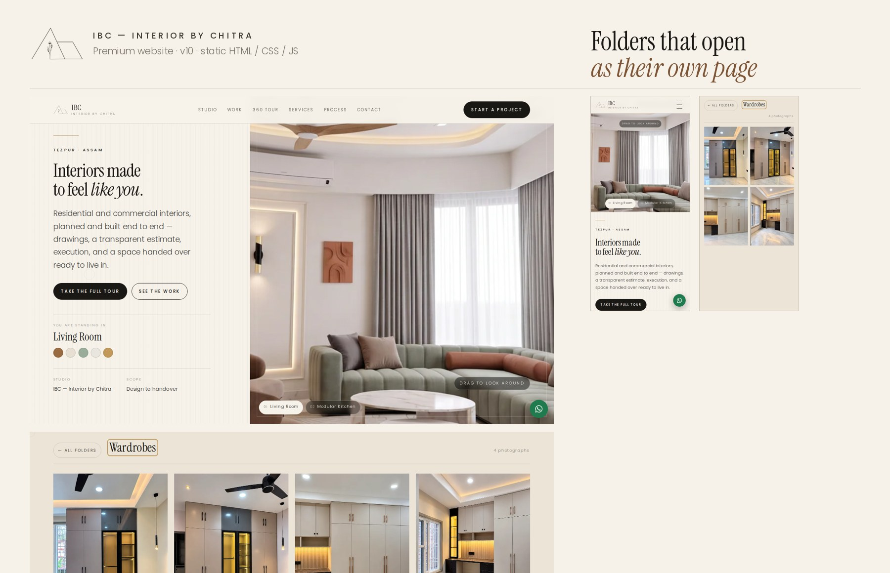

# IBC — Interior by Chitra · Website

A static, single-page website for **IBC — Interior by Chitra**, an interior design studio in
Tezpur, Assam, founded by Chitra Ranjan Neog.

Plain HTML, CSS and vanilla JavaScript. No build step, no frameworks, no CDN calls. Everything —
fonts, scripts, images, video — is served from this folder, so the site works on GitHub Pages,
on any shared host, and by double-clicking `index.html` straight off the disk.



---

## 1. Features

| Section | What it does |
|---|---|
| Hero | **A live, draggable 360° of a finished room.** The visitor is standing inside the work from the first second; room chips along the bottom switch which room they are in. Headline rises line by line, two CTAs, hairline frame, film grain and a scroll cue. Falls back to a still image when JavaScript is off |
| Marquee | Continuous strip of the studio's services |
| 01 The Studio | Studio intro with an asymmetric image pair and four verified facts |
| 02 Selected Work | 26 images in six **folder cards** — Living Room 9, Modular Kitchen 6, Bathrooms 2, Wardrobes 4, Shelving 2, Ongoing Work 3. Each card is a stack of photographs; clicking opens that folder as a **full-screen page** that slides up over the site, with the page behind locked. "All folders" closes it and returns you to the exact scroll position you left. Keyboard accessible, Escape closes. Lightbox works inside |
| 03 Step Inside | **The 360° room tour** — two rooms, drag to look around (see §3), plus a companion bathroom walkthrough video |
| 04 Services | Accordion of the five services, with a hover preview image on desktop |
| 05 Process | The studio's own five-stage process |
| 06 On Site | Four walkthrough reels, MP4 + WebM, played only when scrolled into view |
| 07 Voices | Three client testimonials (paraphrased — see §6) |
| 08 Contact | Enquiry form that opens WhatsApp or email with the message pre-written |
| Everywhere | Sticky header that hides on scroll-down, full-screen mobile menu, floating WhatsApp button, custom cursor on desktop, preloader that skips on repeat visits, 404 page |

Accessibility: skip link, visible focus rings, ARIA on the tabs/accordion/dialog/viewer, full keyboard
support, alt text on every image, touch targets of at least 36 px, and `prefers-reduced-motion`
honoured throughout (animations stop, videos do not autoplay).

---

## 2. Running it

**Double-click `index.html`.** That is the whole thing — it works from `file://`.

To run a local server instead (closer to production, and it lets the 360 tour use WebGL):

```bash
cd IBC_Premium_Website
python3 -m http.server 8080
# then open http://localhost:8080
```

---

## 3. The 360° room tour

The three panoramas are **real photographs of Chitra's finished projects**, not AI images and not
renders. Each one was assembled from the studio's own phone walkthrough footage: every frame is
warped into cylindrical coordinates, the camera rotation between frames is measured, and a thin
vertical slice from the centre of each frame is laid down side by side. Taking only the centre slice
is what stops the operator's walking from causing ghosting.

| Room | Coverage | Resolution | Source |
|---|---|---|---|
| Living Room | full 360° | 4096 x 900 | Generated from the studio's own renders, two halves joined |
| Modular Kitchen | full 360° | 4096 x 900 | Generated from the studio's own renders, two halves joined |

**These two panoramas are design visualisations, not photographs.** Both depict rooms the studio
had already designed and rendered — they were generated from a written specification of the client's
own render set, so they show his design work, not invented spaces. Each was generated as two
ultra-wide 4K halves from a written specification of one of the studio's own rendered rooms, then
joined. Both halves were made so their open edges show the same feature — the fluted oak wall for
the living room, the rose-gold tree screen for the kitchen — so the joined strip closes into a true
loop. Two seams are blended: the centre join between the halves, and the wrap seam where the right
end meets the left. `assets/../join360.py` in the build notes documents the method.

Panoramas are capped at 4096px wide so they stay inside the texture limit of mobile GPUs, with a
1600px preview that loads first.

The studio's real photographed rooms are in *Selected work* and *On site* — the 360 is the polished
visualisation layer, and the page labels it as such.

Rooms under a full turn stop at the ends of their sweep instead of wrapping, and auto-rotate
reverses rather than jumping.

**Three renderers, picked automatically:**

1. **WebGL** — a textured cylinder. Used over `http://` and `https://`.
2. **Canvas 3D** — re-projects the panorama into a true perspective view, one thin vertical strip
   at a time with plain `drawImage`. Used on `file://`, or if WebGL is unavailable or a texture
   upload fails. Geometrically identical to the WebGL view.
3. **Flat** — a scrollable strip. Last resort.

Why the fallback matters: a browser will not let WebGL read an image loaded from `file://`, so
opening the page off the disk *always* uses the canvas renderer. This is deliberate, not a bug.
The canvas renderer never reads pixels back off the canvas, which is what would otherwise trip the
same `file://` security rule.

Force a renderer for testing by adding `?pano=webgl`, `?pano=canvas` or `?pano=flat` to the URL
(`?pano=css` still works and maps to the canvas renderer).

**Controls:** drag or swipe (the room follows your finger), pinch or ctrl+scroll to zoom, arrow keys,
auto-rotate toggle, full screen (with a pseudo-fullscreen fallback for iPhone Safari), room tabs, and
material chips that swing the view round to that material.

---

## 4. File structure

```
index.html              the whole site
404.html                not-found page
preview.jpg             desktop + mobile collage
robots.txt  sitemap.xml  site.webmanifest
.nojekyll               tells GitHub Pages to serve files starting with _
assets/
  css/main.css
  js/main.js            site behaviour
  js/pano.js            the 360 viewer (no dependencies)
  fonts/                Instrument Serif + Poppins, subset, with OFL licences
  icons/                favicon.svg, favicon-32, apple-touch-icon, icon-192, icon-512
  img/
    logo-mark.png       the studio's own logo, keyed to transparency
    logo-lockup.png     logo with wordmark
    og-image.jpg        social share card
    work/               16 project photographs (full + -sm variants)
    concept/            9 design visualisations
    pano/               3 panoramas (full + -preview)
    studio/             founder portrait
  video/                4 reels as MP4 + WebM, each with a WebP poster
```

---

## 5. Deploying to GitHub Pages

1. Create a repository and push this folder's contents to the `main` branch.
2. Repository → **Settings** → **Pages**.
3. Source: **Deploy from a branch**, branch `main`, folder `/ (root)`. Save.
4. The site appears at `https://<username>.github.io/<repo>/` within a minute or two.

For a custom domain, add it under Settings → Pages → Custom domain, then update the URLs in §7.

---

## 6. Where to edit content

**Contact details** appear in several places. Search `index.html` for each and change all matches:

- Phone `9365333187` — the `tel:` links, the JSON-LD block and the footer
- WhatsApp `919365333187` — the floating button's `wa.me` link, and `PHONE` near the top of
  `assets/js/main.js` (the form uses that one)
- Email `Chitraranjanneog38@gmail.com` — the `mailto:` links, the JSON-LD, and `EMAIL` in `main.js`
- Instagram / Facebook / Maps links — header menu, contact block, footer, JSON-LD

**Folders.** The work section is built from folder cards. The markup is a
`.fgrid` of `.fcard` buttons plus a hidden `.fopen` panel containing one `.fbody` per folder;
`assets/js/main.js` toggles them and restores the scroll position on close. Adding a category means
adding a card and a matching `.fbody`.

**Portfolio.** Drop a new image into `assets/img/work/` as `slug.webp` (about 1600 px on the long
edge) plus a `slug-sm.webp` (about 760 px), then copy an existing `<figure class="work__item">`
block in the Selected Work section and change the paths, `data-cat`, `data-title` and alt text.
`data-cat` must be one of `Kitchens`, `Bathrooms`, `Storage`, `Ceilings`, `Living` to match the
filter buttons.

Two build-stage photographs ship in `assets/img/work/` but are **not** on the page —
`wardrobe-bench-niche` and `kitchen-build-in-progress`. They show joinery mid-assembly rather than a
finished room, so they were kept out of the portfolio. Add them the same way if you want to show the
making of a project.

**360 rooms.** The viewer reads `window.IBC_ROOMS`, the small script block just before the closing
`</body>`. Each entry needs `src`, `preview`, `w`, `h`, `hfov` (horizontal degrees the image covers),
`vfov`, `startYaw` (which way the room faces when it opens) and its `materials`.

The viewer is a reusable module: `IBCPano(sectionEl, opts)` in `assets/js/pano.js`. Two instances
run on the page — one in the hero, one in the tour section — each with its own renderer and state.
`opts.hero` marks the hero instance and `opts.spinSpeed` sets its drift rate. Getting `hfov` right matters — it is what makes dragging feel 1:1. To add
a room you need a new cylindrical panorama; ordinary photographs will not work.

**Colours.** All of them are CSS variables at the top of `assets/css/main.css`:

```css
--ivory  #f6f2ea   --bone   #ebe4d7   --sage   #b9baac
--walnut #7c5334   --brass  #c2995b   --ink    #1a1815   --petrol #2c4e5c
```

The palette is taken from Chitra's own work and his logo — the sage is the background colour of the
IBC logo, the petrol blue is the kitchen in the first panorama, and the brass matches his cove
lighting.

**Typography.** Instrument Serif for display, Poppins for everything else, both self-hosted in
`assets/fonts/` with their SIL Open Font Licence files. They are shipped as `.woff` rather than
`.woff2`; every current browser supports WOFF, the files are just slightly larger. If you want
WOFF2, re-subset the originals with `fonttools` on a machine that has the Brotli extension and
update the `@font-face` blocks.

---

## 7. Before launch

- [ ] **Confirm the domain.** Every URL currently points at `https://ibcinterior.in` — taken from
      the old site in the video. If the domain has lapsed or changes, update it in `index.html`
      (`<link rel="canonical">`, the `og:` and `twitter:` tags, and the JSON-LD `url` and `image`),
      `robots.txt` and `sitemap.xml`. `og:image` must stay an **absolute** URL or previews break.
- [ ] **Add the street address and opening hours.** The JSON-LD currently carries only
      Tezpur / Assam / IN, because no verified street address or hours were available. Add
      `streetAddress`, `postalCode` and `openingHoursSpecification` once confirmed.
- [ ] **Replace the testimonials.** The three quotes in *Voices* are paraphrased from the studio's
      previous website and are labelled "paraphrased" on the page. Swap in approved, attributed
      quotes and remove the note beneath them.
- [ ] Check the *Concepts* images are ones the studio is happy to publish; they are labelled
      "design visualisation" so nobody mistakes them for finished rooms.
- [ ] If Chitra can supply unwatermarked reel footage, re-cut the four videos; two currently carry
      his own "INTERIOR BY CHITRA" watermark, which was left in place deliberately.
- [ ] Submit `sitemap.xml` in Google Search Console and claim the Google Business Profile.

---

## 8. Portfolio organisation

Every one of the 26 source files has exactly one destination. The selected-work assets are physically organised into room-based folders under `assets/img/work/`, and the website folder cards match that structure.

| Folder | Count | Contents |
|---|---:|---|
| Living Room | 9 | The living-room completed views plus LR-1 through LR-5 |
| Modular Kitchen | 6 | The kitchen completed views plus MK-1 through MK-4 |
| Bathrooms | 2 | Vanity and mirror views |
| Wardrobes | 4 | Fitted wardrobe and study-wall views |
| Shelving | 2 | Completed shelving and display-unit views |
| Ongoing Work | 3 | Joinery photographed during execution |

The Living Room and Modular Kitchen are intentionally separate portfolio folders. The three unfinished joinery photographs remain in *Ongoing Work* so that execution-stage work is not mixed with finished interiors.

## 9. The bathroom walkthrough

The short clip in *Step inside* was generated from one of the studio's own site photographs of a
marble bathroom, so the room shown is one that was actually built. It carried a visible Gemini
sparkle watermark in the lower right; the video is cropped from 1080x1920 to 1080x1690 before
encoding, which removes it cleanly without blurring or painting over anything — and takes some of
the plastic sheeting on the floor with it.

Two things to be aware of before publishing:

- Google embeds an invisible **SynthID** marker in its generated video. Cropping the visible
  watermark does not remove that, and it is not something to try to strip.
- Check Google's current terms for the tool that produced the clip, in case they require the
  visible mark to be retained. That is a call for you and the client, not something I can decide.

The clip is labelled "Animated from a site photograph" on the page.

## 10. A note on image metadata

The panorama source files Runway produced carry IPTC and XMP metadata identifying them as AI
generated. Re-encoding them to WebP for the web dropped that metadata, so the shipped files no
longer carry it — a side effect of the conversion, not a deliberate removal. The disclosure that
matters is on the page itself: both panoramas are labelled as visualisations in the hero, on the
viewer, and in the tour copy. Keep the original PNGs if you want the provenance preserved.

## 11. Honesty notes

Everything on this site is real, and the few things that are not photographs say so:

- The **360 panoramas** are genuine photographs of completed IBC projects, rebuilt from the studio's
  own walkthrough video. Nothing is AI-generated.
- The two **360 panoramas** are generated visualisations of rooms from the studio's own render set.
  They are labelled as visualisations in three places on the page.
- The **testimonials** are labelled *paraphrased*, with a visible note to replace them.
- The **logo** is the studio's real logo, extracted from its own artwork; the favicon is a
  simplified redraw of the same gable mark.
- The **founder portrait** is Chitra's own photograph, converted to a warm duotone so it sits with
  the rest of the page. No features were altered.
- No awards, project counts, years-in-business or client names have been invented anywhere.

---

## 12. Testing done

Playwright / Chromium, over both a local HTTP server and `file://`, at every one of these sizes:

**Desktop / laptop:** 2560×1440 · 1920×1080 · 1440×900 · 1366×768 · 1280×800
**Tablet:** iPad Pro landscape 1366×1024 · iPad Pro portrait 1024×1366 · iPad landscape 1180×820 ·
iPad portrait 820×1180 · iPad mini 744×1133 · 768×1024
**Phone:** iPhone Pro 393×852 · iPhone SE 375×667 · Android 412×915 · Android 360×780 ·
844×390 landscape

The hero uses a side-by-side split only above 1100px, so portrait tablets — including iPad Pro
portrait at 1024px — get the stacked layout with the 360 on top, which suits a tall screen.

At each size: no horizontal overflow, no console errors, no failed requests, every section revealed,
hero animating, the 360 viewer loaded and draggable with room switching, portfolio filters, lightbox
(open / next / Escape), mobile menu (open and Escape to close), anchor jumps, form validation and the
generated WhatsApp link, and video playback.

A separate visual pass screenshots the viewer itself at all nine sizes, in both renderers and in
each of the three rooms, and measures the rendered pixels — dead columns, black area and overall
brightness — so a viewer that loads but renders wrongly cannot pass.

Also verified: WebGL disabled (falls back to the canvas renderer), `prefers-reduced-motion`
(animation stops, video does not autoplay), and JavaScript disabled (navigation stays reachable,
WhatsApp and phone links still work, no content hidden).

**Not tested:** real iPhone/iPad Safari, real Android Chrome, and actual hardware GPUs — everything
above ran in headless Chromium on Linux. The iOS pseudo-fullscreen path and pinch-zoom in particular
are worth a quick check on a real phone before you show the client.
